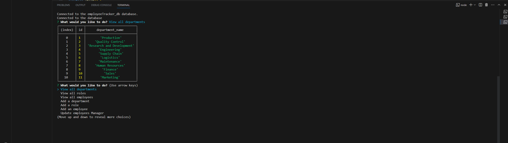

# Nick's Employee Tracker

## Description:

Nick's Employee Tracker is a command-line application that allows users to manage their company's employee database. It provides a user-friendly interface for viewing, adding, and updating information about departments, roles, and employees in the organization. This application is built using Node.js, Inquirer, and MySQL.

## Table of Contents:

- [The Challenge](#The-Challenge)
- [Features](#Features)
- [Installation Process](#Installation-Process)
- [Built With](#Built-With)
- [What I Learned](#What-I-Learned)
- [License](#License)
- [Author](#Author)

# Overview

## The Challenge:

Create an interfaces that allows non-developers to easily view and interact with information stored in an SQL Employee Tracker database. These interfaces are called content management systems (CMS). Objective is to build a command-line application from scratch to manage a company's employee database, using Node.js, Inquirer, and MySQL. Once done, create a walkthrough video that demonstrates the interfaces functionality and acceptance criteria.

## User Story

```md
AS A business owner
I WANT to be able to view and manage the departments, roles, and employees in my company
SO THAT I can organize and plan my business.
```

## Acceptance Criteria

```md
GIVEN a command-line application that accepts user input
WHEN I start the application
THEN I am presented with the following options: view all departments, view all roles, view all employees, add a department, add a role, add an employee, and update an employee role
WHEN I choose to view all departments
THEN I am presented with a formatted table showing department names and department ids
WHEN I choose to view all roles
THEN I am presented with the job title, role id, the department that role belongs to, and the salary for that role
WHEN I choose to view all employees
THEN I am presented with a formatted table showing employee data, including employee ids, first names, last names, job titles, departments, salaries, and managers that the employees report to
WHEN I choose to add a department
THEN I am prompted to enter the name of the department and that department is added to the database
WHEN I choose to add a role
THEN I am prompted to enter the name, salary, and department for the role and that role is added to the database
WHEN I choose to add an employee
THEN I am prompted to enter the employee’s first name, last name, role, and manager, and that employee is added to the database
WHEN I choose to update an employee role
THEN I am prompted to select an employee to update and their new role and this information is updated in the database
```

## Screenshot



## Features

- View all departments: Displays a formatted table with department names and IDs.
- View all roles: Shows job titles, role IDs, department names, and salaries.
- View all employees: Presents a table with employee data, including IDs, names, job titles, departments, salaries, and managers.
- Add a department: Allows the user to input a new department name, which is then added to the database.
- Add a role: Prompts the user to provide title, salary, and department for a new role and adds it to the database.
- Add an employee: Collects the first name, last name, role, and manager information for a new employee and inserts it into the database.
- Update an employee role: Lets the user select an employee to update and assign a new role.

## Walkthrough Video:

[Click Here to Watch.](https://drive.google.com/file/d/1QMF9htz678_LOml_MsDs4rGUo3L4_rdz/view)

## Installation Process

1. Clone the repository to your machine.
2. Install the dependencies:

- Inquirer.js: [Version 8.2.4](https://www.npmjs.com/package/inquirer/v/8.2.4)
- MySQL2: [Version 3.1.2](https://www.npmjs.com/package/mysql2)

3. Create the necessary database tables using the provided SQL schema.
4. Seed the database with initial data (optional).

## Built With

- Dynamic JavaScript
- Inquirer.js: [Version 8.2.4](https://www.npmjs.com/package/inquirer/v/8.2.4)
- MySQL2: [Version 3.1.2](https://www.npmjs.com/package/mysql2)
- Visual Studio Code: [Website](https://code.visualstudio.com/)

## What I Learned

1. Constructing a Command-Line Application: I gained insights into constructing a command-line application from the ground up, allowing for the management of an employee database. This was achieved by utilizing technologies such as Node.js, Inquirer, and MySQL.
2. Developing a Comprehensive Content Management System (CMS): I successfully created an extensive content management system, empowering users to efficiently interact with database information. This involved designing and implementing a diverse range of features.
3. Producing an Effective Walkthrough Video: I created a clear and concise walkthrough video that effectively showcases the functionality of the interfaces, demonstrating how they meet the specified acceptance criteria and even surpassing certain bonus criteria.

## License & Copyright ©

[](https://opensource.org/licenses/MIT) [Open Source Initiative Link](https://opensource.org/licenses/MIT)

## Author

Follow me on Github at [NickUCLA](https://github.com/NickUCLA)! Additional questions or concerns? feel free to contact me at nheal179@gmail.com.
